## 环境介绍：

本示例使用 `Vagrant` 工具模拟 Linux 环境

* 操作系统: 		CentOS/7
* 内存：			4G
* IP: 				192.168.33.10/24
* Docker：			docker-17.12.1
* Docker-compose：1.21.2
* Jenkins:		2.107.3
* Gitlab:			gitlab-ce:10.7.3-ce.0

## Jenkins 安装

[Jenkins 安装详见 Jenkins 安装](install-jenkins.md)

## Gitlab 安装

Gitlab 默认启动在 80 端口，输入 IP:80 端口访问 Gitlab 服务，首次访问 Gitlab 将需要重置管理员密码。

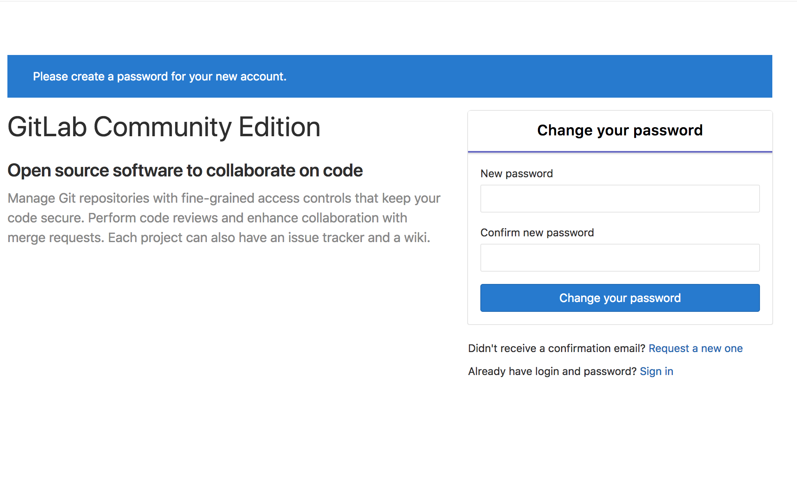

### Gitlab 用户登录/注册

Gitlab 管理员密码重置后，将进入登录注册页面；
Gitlab 默认管理账号（root）；

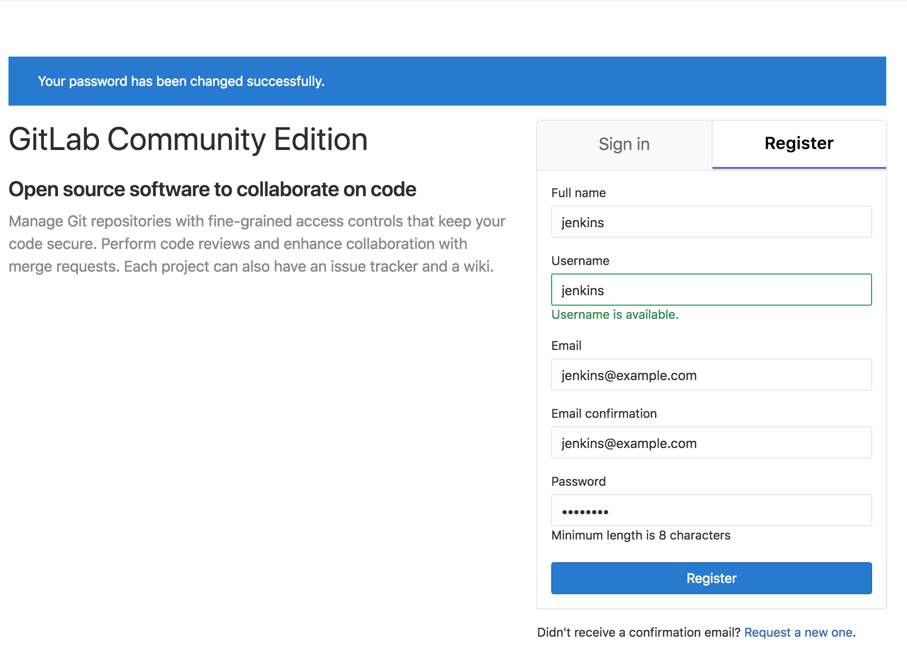

> 注: 建议为个人访问建立个人账号，并加入到管理组;

以管理员账号登录 gitlab，点击 Admin Area -> Overview -> User 为我刚创建的账号（gitlab）添加到管理组；

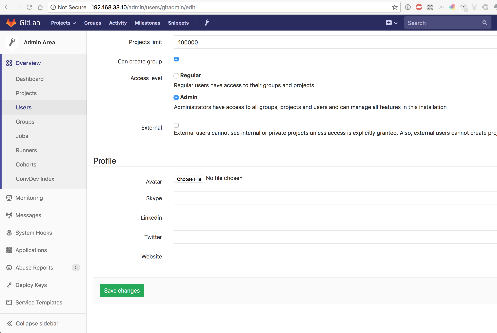

### Gitlab 创建私有项目组及私有项目，将我们 gradle 项目推送到 gitlab 私有仓库

图略

```
git remote add gitlab http://192.168.33.10/groups/private_project.git
git push   gitlab master

git remote add gitlab http://192.168.33.10/recruiting-system/2018-04-02-01-27-37-1522632457.git
git push gitlab master
```

> 注：由于我们虚拟机的 SSH 服务已绑定到 22 号端口，所以我们在启动 gitlab 的时候，把 git:// 协议绑定的端口设置到了 2222，所以在本地克隆、提交代码时将会稍有麻烦，因此在此建议使用 http 端口克隆提交项目；

## 新建 Pipeline

### Pipeline 创建

进入 Jenkins 首页，选择 New Item -> Pipeline，输入 Pipeline 名称：


### 配置从 GIT 仓库读取 Pipeline 配置

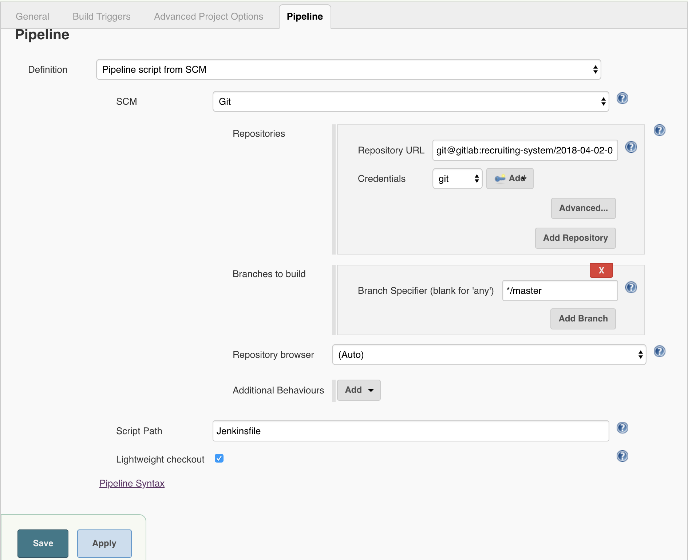

点击确定，即可完成 Pileline 的配置。

> 注：在项目的根目录下提交我们自己写的 Jenkinsfile 用来描述 pipeline 的定义，在此，我们使用项目根目录下的 Jenkinsfile-1 的示例；
> 注: Jenkinsfile-1 示例脚本是使用 `./gradlew` 命令自动下载 `gradle` 程序进行构建，因为默认 Jenkins 的镜像并不包含 gradle 的构建环境，因此一般有两种方式来解决：
> 1、基于 Jenkins Master 镜像添加 gradle 的运行环境；
> 2、基于 Jenkins + Slave 的结构，部署 Slave 节点添加 gradle 构建环境；
> 我们在后面再继续介绍.

### 为 Jenkins 生成 Gitlab 部署 Key（Deploy Key)

我们为 Jenkins 克隆 Gitlab 仓库使用 SSH 私钥的方式

```
# 使用 ssh-keygen 生成部署 Key
$ ssh-keygen -t rsa -f /tmp/jenkins

# 命令执行成功后，将在 /tmp 目录下生成 jenkins 公钥及私钥
$ ll /tmp/jenkins*
-rw-------. 1 root root 1675 May 23 10:12 /tmp/jenkins
-rw-r--r--. 1 root root  408 May 23 10:12 /tmp/jenkins.pub
```

### 为 Jenkins 添加部署 Key（Add Credentials）


### 为 Gitlab 添加部署 Key

点击项目设置 Settings -> Repository -> Deploy Keys

Create a new deploy key for private project

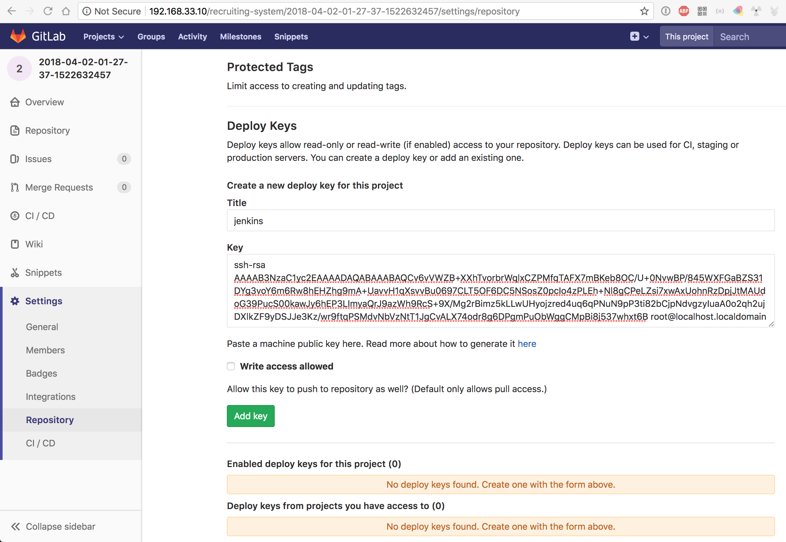

### BUILD NOW

点击 `Build Now` 即可立即开始构建项目（手动构建的方式）;

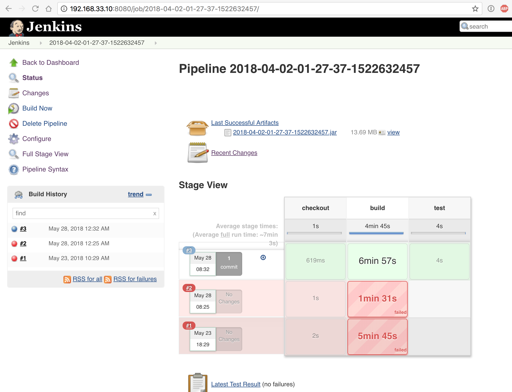

如上图，为 Jenkins 构建成功的视图。左下角显示了 Jenkins 构建历史，右上角为保存的 Artifact，右下角显示了 Stage View 的视图；

## Gitlab WebHook 配置

gitlab Webhook 主要为了解决，当 push 源代码到 gitlab 仓库，gitlab 自动触发 jenkins pipeline 做持续构建的过程；

### Jenkins 安装 gitlab 插件

Jenkins 为了与 Gitlab 集成，需要借助 Gitlab 的插件才能完成；

Manager Jenkins -> Manager Plugins -> Avaiable

搜过 gitlab

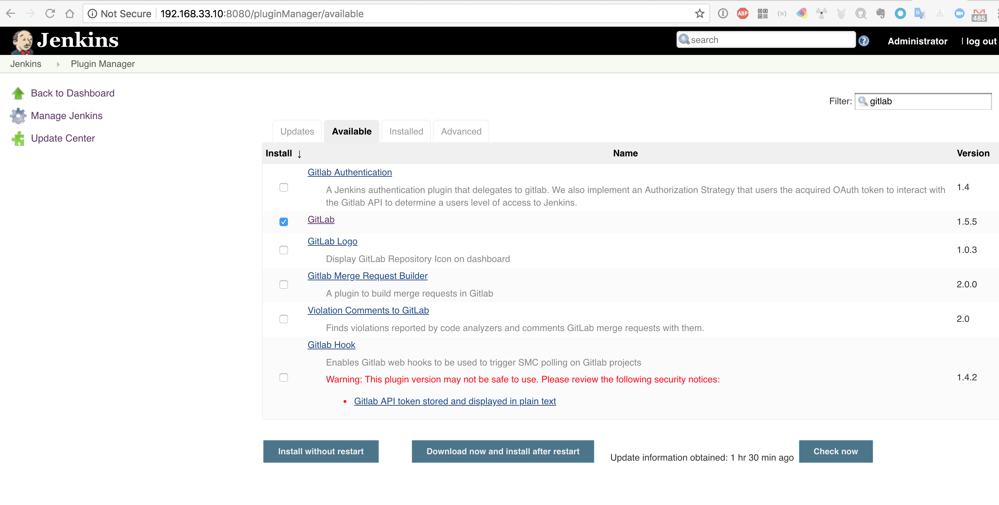

### 为 Jenkins 创建 API 访问 Token

使用刚刚创建的 gitadmin 账号，进入个人设置页面（Settings -> Access Token）：

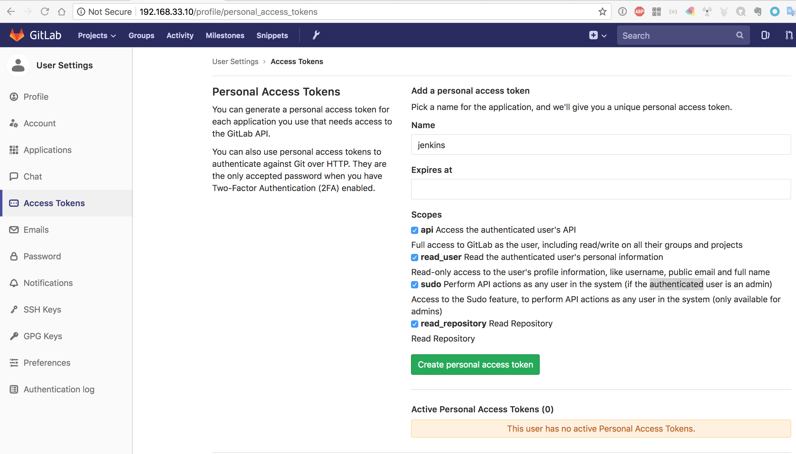

点击 `Create personal access token` 成功后，即可生成个人访问 Token:


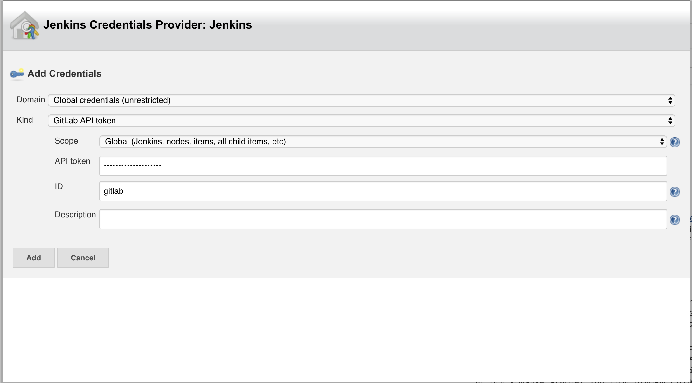

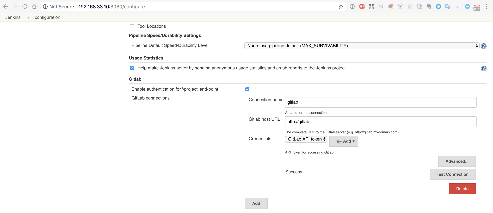

测试成功后，点击保存。

回到 Jenkins Pipeline 配置界面，生成 `secret token`

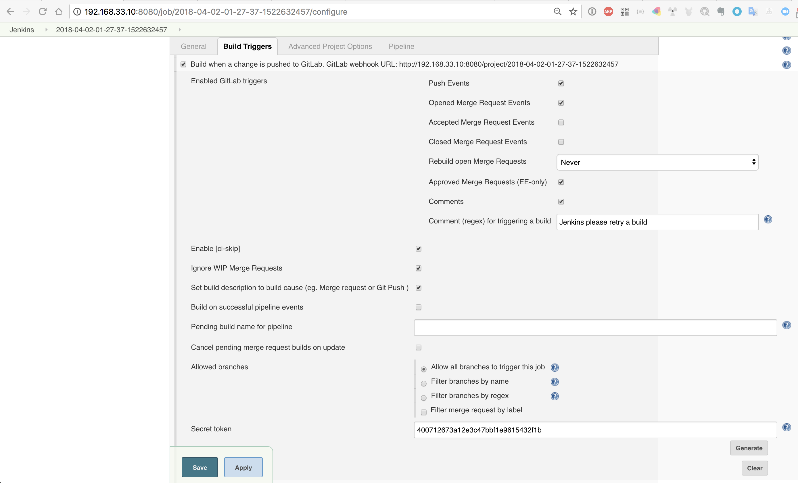

拷贝 `secret token` 配置 Gitlab Web-Hooks

项目 Settings -> Integrations -> Add Web Hooks

输入 GitLab webhook URL、Secret Token，取消 `Enable SSL verification`，点击添加 Webhook。


> 注：关闭 SSL 验证，我们再次并没有使用 SSL 服务；

Gitlab Webhook 配置成功后，点击测试推送 `push event` 事件，即可自动触发 Jenkins Pipelien 做自动构建；

默认发送测试 push 请求将返回 500 错误，

Admin Area -> Settings -> Outbound Requests

勾选 'Allow requests to the local network from hooks and services.' 即可解决；

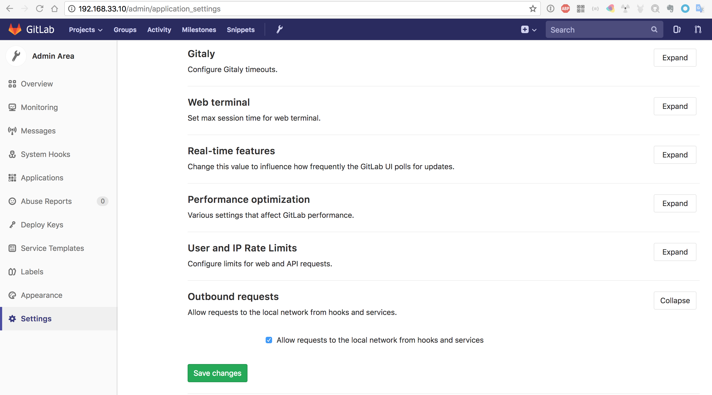

## Pipeline 定义构建 Docker Image，推送到 Docker Hub 官方仓库

在此，我们以 Docker Hub 官方仓库为例，演示如何构建 docker image，将镜像推送到 Docker Hub 官方仓库；

### Docker Hub 官方仓库创建

Docker Hub 官方仓库地址

https://hub.docker.com/

### 为 Docker Hub 创建 credentials

此处创建的 credentials 为 Jenkins 构建用来登录/访问 Docker Hub 的凭证（即刚刚在 Docker Hub 上创建的账号）；

Jenkins 首页 -> Credentials -> System -> Global credentials -> Add Credentials

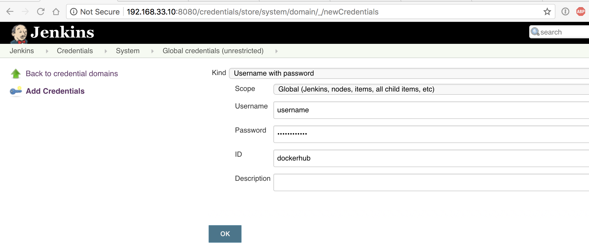

注: credentials id 为方便 Jenkinsfile 中引用 credentials 使用;

### Jenkinsfile 

```
#! groovy

node {
    stage('checkout') {
        checkout scm
    }

    stage('build') {
        sh './gradlew clean build'
        step([$class: 'ArtifactArchiver', artifacts: '**/build/libs/*.jar', fingerprint: true])
    }

    stage('test') {
        sh './gradlew test'
        step([$class: 'JUnitResultArchiver', testResults: '**/build/test-results/test/TEST-*.xml'])
    }

    stage('package') {
        docker.withRegistry('https://index.docker.io/v1/', 'dockerhub') {
            def customImage = docker.build("cnhttpd/2018-04-02-01-27-37-1522632457:${env.BUILD_ID}")
            /* Push the container to the custom Registry */
            customImage.push()
        }
    }
}
```

* 我们定义第三个 stage `package`
* docker.withRegistry 为定义 Docker 仓库，我们使用 Docker Hub 官方仓库，第二个参数为 credentials Id
* docker.build 为镜像构建，注册镜像的名称及TAG，由于 Docker Hub 上镜像格式为：

username/imagename:tag

因此，我们在镜像格式的时候要遵循 Docker Hub 的规范，如果是私有仓库，此处可以随意定义；
* TAG 标识，我们使用环境变量（${env.BUILD_ID}），BUILD_ID 即为构建 ID。注：这个值要持续的变化，我们一般使用 BUILD_ID 作为版本号；
* customImage.push() 即为推送镜像到 Docker Hub 官方仓库；

### 构建成功

如果 Pipeline 执行成功，我们就可以在 Docker Hub 访问到我们刚刚构建成功的镜像，并且通过 docker pull 拉取镜像;

我们可以点击 Build History, 查看构建历史（控制台输出、修改记录、git commit等）；

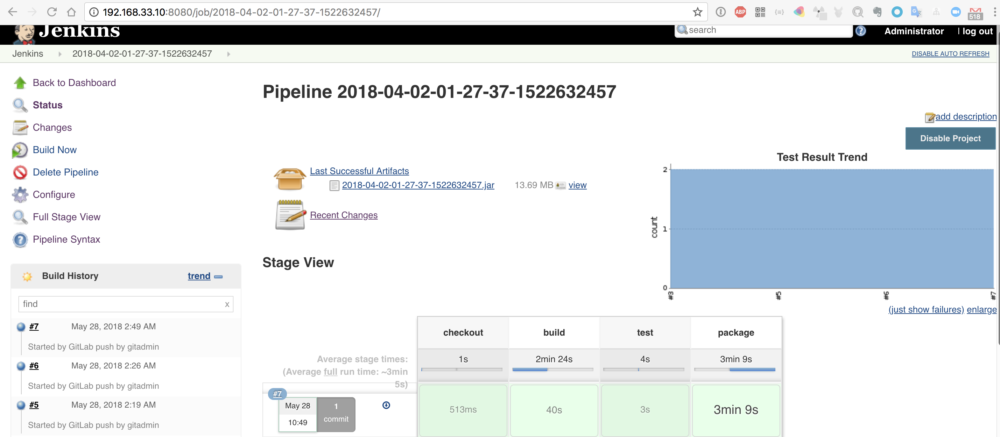

如上图，右侧截图显示了保存的 Artifact、测试报告、stage view 等；

至此，我们持续集成的工作就基本结束.

## 参考文档:

* https://hub.docker.com/r/jenkins/jenkins/
* https://github.com/jenkinsci/docker/blob/master/README.md
* https://jenkins.io/doc/book/pipeline/docker/
* https://jenkins.io/doc/book/using/using-credentials/
* https://getintodevops.com/blog/building-your-first-docker-image-with-jenkins-2-guide-for-developers
* https://github.com/jenkinsci/gitlab-plugin/issues/375
* https://www.swtestacademy.com/jenkins-gitlab-integration/